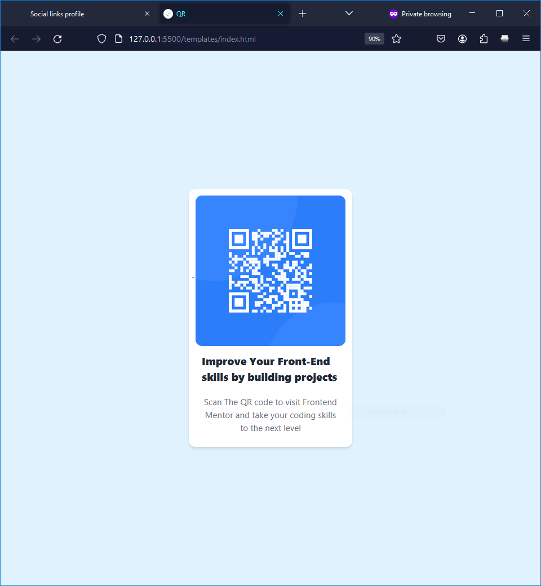
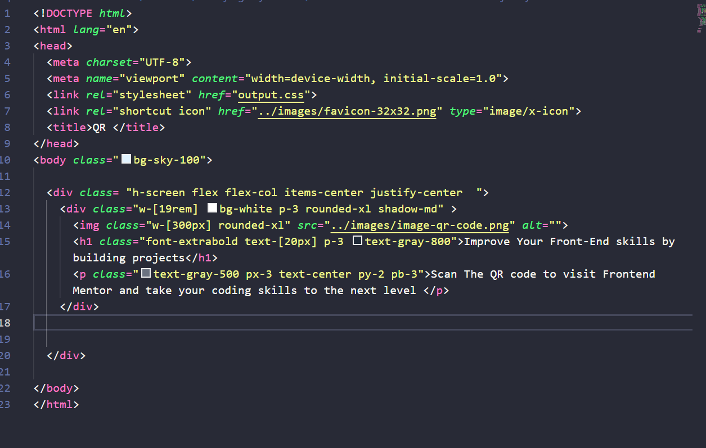

## Table of contents

- [Overview](#overview)
  - [Screenshot](#screenshot)
  - [Links](#links)
- [My process](#my-process)
  - [Built with](#built-with)
  - [What I learned](#what-i-learned)
  - [Continued development](#continued-development)
  - [Useful resources](#useful-resources)
- [Author](#author)

## Overview

### Screenshot

### Links

- Solution URL:(https://github.com/Blip-Loban/QR-code-component-solution)
- Live Site URL: [Add live site URL here](https://your-live-site-url.com)

## My process
   
   I started with Basic HTML then tried to find a way to center the content then worked my way up to add the styles.

### Built with

- Semantic HTML5 markup
- Tailwind CSS

### What I learned

- How to center an item and add shadow
- Adding colors
- Margin and padding in tailwind CSS

### Continued development

I would like to learn React and Next JS for future.

### Useful resources

- [Tailwind Documentation](https://tailwindcss.com/docs/installation) - If your designing using tailwind the documentation is the only thing you will need.

## Author

- Website - [Mutasim Fuad Sarker](https://www.facebook.com/loban.sharker)
- Frontend Mentor - [@Blip-Loban](https://www.frontendmentor.io/profile/Blip-Loban)
- Twitter - [@MutasimFuadSRK](https://twitter.com/MutasimFuadSRK)
- 

